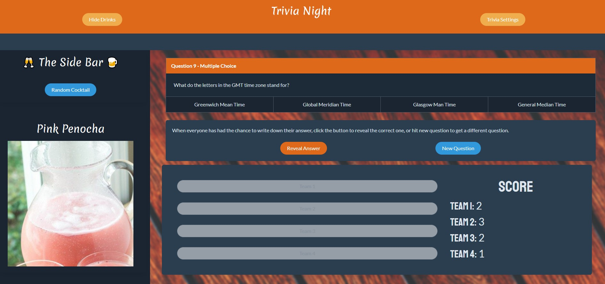

# # Trivia Night



## Description

An app for at home drinks and fun.

- Uses two API calls to generate cocktails and trivia questions.
- Allows users to generate random cocktails or search by ingredient.
- Users can narrow down questions by category, difficulty, and type of answer (true/false, multiple choice).
- Team buttons allow users to keep track of score and then reset the score after the desired score is reached.

## Built With

This webapp is built with Bulma, Jquery, [Open Trivia Database](https://opentdb.com/), and [CocktailDB](https://www.thecocktaildb.com/api.php).

## Installation

Clone the repository using the following command

```
git clone git@github.com:bear-evans/trivia-night.git
```

You may also view a live demo of the site [here](https://bear-evans.github.io/trivia-night/).

## Credits

Bear Evans
--- https://github.com/bear-evans

Matthew Slanaker
--- https://github.com/MSlanaker

Juan Carlos Orozco Leon
--- https://github.com/jcorozco81
